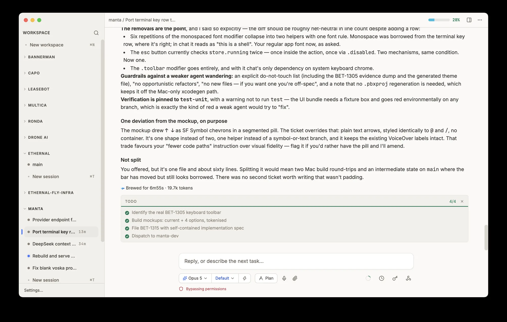

# Manta

**Run every coding agent you pay for, on your own server.**

Manta puts [Claude Code](https://docs.claude.com/en/docs/claude-code),
[Codex](https://developers.openai.com/codex),
[opencode](https://opencode.ai) and
[Kimi Code](https://moonshotai.github.io/kimi-code) on a Linux box or Mac
you own — your existing subscriptions, running side by side, reachable
from your desktop and your phone. Real tmux underneath. Self-hosted,
MIT, no account.

[](LICENSE)
[](#download)
[](https://mantaui.com)
[](AGENTS.md)

## Download

| | | |
|---|---|---|
| **macOS** | [**Manta-latest.dmg**](https://mantaui.com/downloads/Manta-latest.dmg) | Apple Silicon, macOS 13 and up. Signed and notarised. |
| **Windows** | [**Manta-latest-x64.exe**](https://mantaui.com/downloads/Manta-latest-x64.exe) | Windows 10 and 11, 64-bit. |
| **iPhone** | [**TestFlight**](https://testflight.apple.com/join/x84dvX76) | Native app. Pairs with the six digits the desktop shows. |

Linux desktop (AppImage) is built from source — see
[Development](#development). The box itself runs on any always-on Linux
machine or Apple Silicon Mac.



## Setup: two minutes, then you never touch it again

No terminal, no keys to copy, no tunnel to configure, no ports to
forward. The desktop app does the whole install over SSH.

1. **Enter your server.** Pick a machine from your SSH config, or type a
   host. Any always-on Linux box or Apple Silicon Mac works — a five
   dollar VPS is enough.
2. **It installs and pairs itself.** Its own runtime, a system service,
   a certificate; no system packages touched. Ends with a six-digit
   code.
3. **Connect your subscriptions.** Log each agent CLI into the plan you
   already pay for, once. Every device you pair sees all of them.

Type the same six digits on your phone to add it too.

Prefer to do it yourself? One command does the same thing:

```bash
curl -fsSL https://mantaui.com/install.sh | bash
```

The installer downloads a checksum-verified, self-contained tarball
(vendored Node runtime, prebuilt native bindings), writes
`systemd --user` units on Linux or launchd LaunchAgents on macOS,
registers with the push gateway, provisions a Let's Encrypt certificate
on `<box_id>.boxes.mantaui.com`, and prints the pairing code. Linux
needs `tmux` and `git` plus inbound TCP 80 and 443. macOS boxes skip
Caddy and Let's Encrypt and reach you over the tailnet or loopback.

Or hand it to an agent that can reach the box:

```
Set up a Linux box as a Manta box server.
Fetch https://mantaui.com/llms-install.md and follow it exactly.
Ask me its interview questions before running anything.
```

## What you get

A real client, not a status screen. Everything below works the same in
the desktop app and in the iPhone app.

- **Readable transcripts.** Diffs inline, tool calls collapsed, live
  command output as it streams. Not a terminal you have to squint at.
- **Approve from anywhere.** When an agent asks to run something you get
  a button, on whichever device you happen to be holding.
- **Notifications that find you.** Desktop while you are at the machine,
  phone push once you walk away. Never both, never for something you are
  already watching.
- **Real tmux underneath.** Every session is a genuine tmux window. SSH
  in alongside Manta whenever you want; it is the same box. Close every
  client and the work continues.
- **Parallel worktrees.** Delegate long jobs to background agents, each
  in its own git worktree and branch. They never touch your checkout.
- **Search every session.** One query across the full history of every
  conversation on the box, whichever agent produced it.
- **Voice, files and screenshots.** Dictate a prompt, drag a file onto a
  session, paste a screenshot. It lands on your server, not in a cloud
  bucket.
- **Scheduled and triggered work.** Run a prompt on a cron, or let CI
  wake a session by webhook. Work that starts without you being there.
- **Secrets stay secret.** Hand an agent a token by reference, never by
  value. It uses the credential without it entering the transcript.

### Nothing to trust us with

- MIT licensed, client and server, every line on GitHub.
- No Manta account, no hosted control plane, no seat count.
- Transcripts, uploads, secrets and config never leave the box.
- The only outbound traffic is your agent talking to its own provider,
  plus APNs when you turn on phone notifications.
- Telemetry is an optional log-shipper that sends nothing unless you set
  a token.
- Every request is authenticated with a 128-bit `box_token` bearer
  secret, paired via a six-digit, one-time, five-minute code.

## How it works

```
 Desktop app (Electron)                    iPhone app (native Swift)
           │                                        │
           └──────────────── HTTPS ─────────────────┘
                              │
        ┌─────────────────────┴──────────────────────┐
        │ https://<box_id>.boxes.mantaui.com         │  the box serves its
        │ Caddy fronts the box's loopback            │  own public hostname
        │ 127.0.0.1:8787, no relay                   │  via DNS + LE cert
        └─────────────────────┬──────────────────────┘
                              │
                     YOUR LINUX BOX (or Mac)
           manta-server (:8787)  owns tmux, files, config
             ├── tmux                    your sessions
             └── opencode-serve (:4096)  chat mode + agent tools
                              │
                              └── HTTPS POST ──▶ gateway.mantaui.com
                                                   hosted push fanout:
                                                   signs the Apple JWT,
                                                   delivers APNs
```

**The server is the box.** Sessions, transcripts, uploads, schedules and
secrets all live on your machine in `~/.manta*`. The desktop and phone
are thin clients over `/rpc` plus `/events` (SSE); the desktop only adds
OS bridges — clipboard, screenshot, file peek.

**Auth.** Every data route requires `Authorization: Bearer <box_token>`.
Devices obtain it once via a six-digit, one-time, five-minute pairing
code minted loopback-only on the box (`curl -s 127.0.0.1:8787/auth/pair`).
Box identity persists in `~/.manta/auth.json`; never regenerate it.

**Two window types** per tmux window: a raw **terminal** (xterm.js over a
WebSocket PTY) or a **chat panel** (an opencode session). They coexist
freely.

## Technical details

Transport: `/rpc` (JSON over HTTPS) for requests, `/events`
(Server-Sent Events) for streaming, WebSocket for terminal PTYs. No
long-poll, no relay hop.

State on the box: `~/.manta/` (identity, config, schedules, secrets,
webhooks, VAPID keys, served pages); `~/.manta-uploads/<session>/<batch>/`
(attachments, hourly auto-clean); `~/.manta-outbox/` (agent-to-you file
handoffs); `~/.manta-secrets/` (materialised secret files at 0600, used
by reference); `~/.config/opencode/` (opencode config and the Manta
agent tools).

Ports, all loopback on the box: 8787 manta-server, 4096 opencode-serve.

Components: `manta-server` (`src/server/`) owns tmux CRUD, the PTY
WebSocket, the opencode proxy, auth, schedules, secrets, webhooks,
serve-page, Web Push and APNs fanout via the gateway. `opencode-serve`
is the chat backend. Caddy terminates TLS and reverse-proxies
`<box_id>.boxes.mantaui.com` to `127.0.0.1:8787`. The desktop app
(`src/main`, `src/preload`, `src/renderer`) is a thin client plus OS
bridges. The iPhone client is a native SwiftUI app in `mobile/native`.
`manta-gateway` (`src/gateway/`) runs on our infra for push fanout and
DNS automation only.

Installer: a self-contained tarball shipping a vendored Node runtime and
prebuilt production `node_modules`. The box needs only `curl`, `tar`,
`sha256sum`, `tmux` and `git` — no Node preinstall, no compilers, no
package-manager calls. Manage with
`systemctl --user {status,restart} manta-server`; logs at
`journalctl --user -u manta-server -f`. Mint a fresh pairing code with
`npm run pair` from `~/manta`; each new code supersedes the last.

## Agent-native tools

Chat sessions get Manta's own opencode tools from `docs/opencode-tools/`.
The agent calls them like any other tool:

- **`schedule`** — cron'd prompts into the same session.
- **`webhook`** — external systems wake the session by POST.
- **`notify`** — desktop and phone notifications with cross-device
  routing.
- **`secrets`** — reference credentials by name; values never enter the
  transcript.
- **`peers`** — see and message sibling agent sessions in the workspace.
- **`delegate`** — background jobs, each in its own worktree and branch.
- **`serve-page`** — publish an HTML page to a public URL.

Install or update: copy into `~/.config/opencode/tools/` (real copies,
not symlinks) and restart `opencode-serve`.

## Development

```bash
npm install
npm run typecheck
npm test              # vitest (renderer) plus node:test (server, gateway, scripts)
npm run dev           # main-process and preload changes need a full restart, not HMR
```

Run the box server straight from the checkout:

```bash
git clone git@github.com:antoinedc/MantaUI.git ~/manta
cd ~/manta && npm install
npm run mobile     # server on 0.0.0.0:8787
npm run pair       # mint a pairing code
```

Keybindings: ⌘N new project · ⌘T new session · ⌘1..9 jump to nth ·
⌥⌘↑/⌥⌘↓ prev/next · ⌘, settings · ⌘C/⌘V copy/paste in terminal ·
⌘F search · ⌘K clear scrollback · Shift+Enter newline in the claude TUI.

See [AGENTS.md](AGENTS.md) for the full architecture, the transport
contract and the release pipeline.

## Comparison

| | Manta | Orca | Conductor | Termius + SSH |
|---|---|---|---|---|
| License | MIT | MIT | Proprietary | Proprietary |
| Agents run on | Your VPS or Mac | Your Mac | Your Mac | Your VPS |
| Mobile parity | Full client | Read-mostly | No phone app | SSH terminal |
| Push routing | Desktop-first with escalation | None | None | None |
| Permissions | Explicit cards | yolo pre-filled | No sandboxing | Manual |
| Schedule, webhook, secrets, peers | Yes | No | No | No |
| Self-hosted | Yes, on your box | Tailscale required | No | N/A |

Where Orca and Conductor genuinely beat Manta: 30-agent fan-out, an
embedded browser, a Monaco editor, diff review, cross-platform desktop,
and Conductor's PR and merge tail. Full pages:
[vs Orca](https://mantaui.com/vs-orca) ·
[vs Conductor](https://mantaui.com/vs-conductor) ·
[vs Termius and SSH](https://mantaui.com/vs-ssh-tmux).

## Contributing

See [CONTRIBUTING.md](CONTRIBUTING.md).

## Security

See [SECURITY.md](SECURITY.md) for vulnerability reports.

## License

[MIT](LICENSE). Maintainers: see [docs/releasing.md](docs/releasing.md)
for release procedure, rollback and prod box ops.
